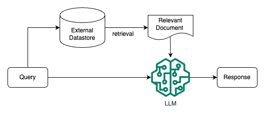

# Tiny RAG

## 1.简介

实现一个很小很小的RAG系统；

详细文档：[doc](doc/README.md)

### 1.1 RAG简介

**检索增强 LLM ( Retrieval Augmented LLM )**，简单来说，**就是给 LLM 提供外部数据库，对于用户问题 ( Query )，通过一些信息检索 ( Information Retrieval, IR ) 的技术，先从外部数据库中检索出和用户问题相关的信息，然后让 LLM 结合这些相关信息来生成结果**。下图是一个检索增强 LLM 的简单示意图。



传统的信息检索工具，比如 Google/Bing 这样的搜索引擎，只有检索能力 ( **Retrieval-only** )，现在 LLM 通过预训练过程，将海量数据和知识嵌入到其巨大的模型参数中，具有记忆能力 ( **Memory-only** )。从这个角度看，检索增强 LLM 处于中间，将 LLM 和传统的信息检索相结合，通过一些信息检索技术将相关信息加载到 LLM 的工作内存 ( **Working Memory** ) 中，即 LLM 的上下文窗口 ( **Context Window** )，亦即 LLM 单次生成时能接受的最大文本输入。

### 1.2 技术路线

  - 将wiki、baike 特定的文本进行向量化后，存储在离线向量数据库中；
  - 在线检索离线数据库；
  - 将检索结果重排后，送到llm，构造prompt，llm输出结果

### 1.3 采用技术


- 文档解析：支持 txt, markdown, pdf, word, ppt，图像等向量化
- 文档embedding：主要使用bge，同时有在线zhipu，openai embedding
- 图像embedding: 使用 clip-vit 进行图像embedding
- 句子切分：支持模型和规则切分
  - 模型切分： 采取的文档语义分割模型为 nlp_bert_document-segmentation_chinese-base， 论文见https://arxiv.org/abs/2107.09278
  - 规则切分
- llm：主要支持qwen2本地调用，同时支持市面api
- 向量数据库： 使用 faiss 向量数据库
- 召回：实现多路召回
  - 向量召回：将句子 bge 模型编码后，使用 faiss 数据库召回 top-n
  - bm25召回：使用 bm25 算法关键字召回
- 重排： 结合多路召回的结果，使用 bge-ranker 模型进行重排

## 2.项目文件简介

具体如下所示：

```shell
├─data                  # 存放原始数据和向量数据库文件夹
│  ├─db                 ## 缓存数据库文件 
│  │  ├─bm_corpus       ### bm25 召回缓存数据
│  │  └─faiss_idx       ### 向量召回缓存数据
│  ├─parser_test
│  └─raw_data           ## 原始数据
├─doc                   # 相关文档
├─models                # 模型存放文件夹
│  ├─bge-reranker-base
│  ├─bge-small-zh-v1.5
│  ├─clip-ViT-B-32
│  └─nlp_bert_document-segmentation_chinese-base
├─script                # 执行脚本文件
├─test                  # 测试文件
└─tinyrag               # tinyrag
    ├─embedding         ## embedding
    ├─llm               ## llm
    ├─parser            ## 文档解析
    └─searcher          ## 根据query搜索相关文档
       ├─bm25_recall    ### bm25召回
       ├─emb_recall     ### 向量召回
       └─reranker       ### 重排

```

## 3.运行

主要运行脚本位于 `script` 文件夹下；

### 3.1 需要下载的模型

- [Qwen2 LLM](https://huggingface.co/collections/Qwen/qwen2-6659360b33528ced941e557f)
- [bge-reranker-base](https://huggingface.co/BAAI/bge-reranker-base)
- [bge-small-zh-v1.5](https://huggingface.co/BAAI/bge-base-zh-v1.5)
- [clip-ViT-B-32](https://huggingface.co/sentence-transformers/clip-ViT-B-32)
- [nlp_bert_document-segmentation_chinese-base](https://www.modelscope.cn/models/iic/nlp_bert_document-segmentation_chinese-base)

> 注意：为了测试，模型都比较小，如果需要追求好一点的效果，请使用更大的模型；
> 
> 注意：如果不需要图片向量化，不用下载`clip-ViT-B-32`
> 

### 3.2 配置文件 `RAGConfig`

配置文件在 `config` 目录下，详细配置类位于 `tinyrag\tiny_rag.py`

`RAGConfig`配置类

```python
class RAGConfig:
    base_dir:str = "data/wiki_db"                     # 工作目录
    llm_model_id:str = "models/tiny_llm_sft_92m"      # LLM 模型
    emb_model_id: str = "models/bge-small-zh-v1.5"    # 文本 embedding 模型
    ranker_model_id:str = "models/bge-reranker-base"  # 排序模型
    device:str = "cpu"                                # 模型运行设备
    sent_split_model_id:str = "models/nlp_bert_document-segmentation_chinese-base"  # 句子分割模型
    sent_split_use_model:bool = False                 # 句子分割是否需要使用模型
    sentence_size:int = 256                           # 句子最大长度
    model_type: str = "tinyllm"                       # 推理模型，支持 [qwen2, tinyllm]
```

json 配置文件 `config\qwen2_config.json`

```json
{
    "base_dir": "data/wiki_db",
    "llm_model_id": "models/tiny_llm_sft_92m",
    "emb_model_id": "models/bge-small-zh-v1.5",
    "ranker_model_id": "models/bge-reranker-base",
    "device": "cpu",
    "sent_split_model_id": "models/nlp_bert_document-segmentation_chinese-base",
    "sent_split_use_model": false,
    "sentence_size": 256,
    "model_type": "qwen2"
}
```

### 3.3 构建离线数据库

需要将一个个 doc 文档存入列表，或是文件读取，具体代码参考如下，来自 `script/tiny_rag.py`

```python
def build_db(config_path, data_path):
    # json_path = "data/raw_data/wikipedia-cn-20230720-filtered.json"
    raw_data_list = read_json_to_list(data_path)
    logger.info("load raw data success! ")
    # 数据太多了，随机采样 100 条数据
    # raw_data_part = random.sample(raw_data_list, 100)

    text_list = [item["completion"] for item in raw_data_list]

    # config_path = "config/build_config.json"
    config = read_json_to_list(config_path)
    rag_config = RAGConfig(**config)
    tiny_rag = TinyRAG(config=rag_config)
    tiny_rag.build(text_list)
```

运行如下命令，构造离线数据库

```python
python script/tiny_rag.py -t build -c config/qwen2_config.json -p data/raw_data/wikipedia-cn-20230720-filtered.json
```

离线数据库会储存在配置文件 `base_dir` 目录下，具体有以下文件：

```shell
├─bm_corpus         # bm25 检索离线数据库
└─faiss_idx         # 向量检索离线数据库
    └─index_512
```

### 3.4 在线检索

> 注意：确保之前已经构建完成离线数据库了

运行以下命令，开始在线检索数据库：

```python
python script/tiny_rag.py -t search -c config/qwen2_config.json
```

输出

```shell
prompt: 参考信息：
现居于北京市。
* 北京：北京
其总部设立于中国的首都北京。
两京并立，北京为首都，南京为留都。
平原上的主要城市有北京、天津、石家庄、雄安新区等，其中北京为现在中华人民共和国首都。
1987年，北京故宫（紫禁城）被登录为世界文化遗产。
---
我的问题或指令：
请介绍一下北京
---
我的回答：
北京是中国的首都，是一个历史悠久、文化多元的城市。这座城市拥有丰富的历史文化遗产和现代化的城市风貌，如故宫、天安门广场等。此外，北京还是中国科技产业发展的中心，拥有世界一流的科技公司。如果你喜欢历史文化，那么你可以去北京的南戴尔达高等科技园区。
---
请根据上述参考信息回答和我的问题或指令，修正我的回答。前面的参考信息和我的回答可能有用，也可能没用，你需要从我给出的参考信息中选出与我的问题最相关的那些，来为你修正的回答提供依据。回答一定要忠于原文，简洁但不丢信息，不要胡乱编造。我的问题或指令是什么语种，你就用什么语种回复。
你修正的回答:
output:  北京是中国的一座古代文明首都。它的建筑历史可以追溯到公元前4世纪。故宫是明清时期的中国皇宫。长城是世界著名的旅游景点之一，也是中国古代建筑的杰出代表。这些城墙的长度大约为40公里，建筑面积约为15万平方米。除此之外，中国还修建了众多宫殿和庙宇，以及其他著名的建筑，如故宫博物馆和颐和园等。
```

## 4.开发

### 4.1 向量模型

向量模型位于 `tinyrag/embedding` 目录下，现支持如下 embeddings :

- HF embeddings : BGE ...
- IMG embedding : CLIP ...
- openai embedding
- zhipuai embedding

如果想要增加其他 embeddings 模型，继承 `tinyrag/embedding/base_emb.py` 文件中 `BaseEmbedding` 类，实现 `get_embedding` 方法即可。

`BaseEmbedding` 基类，如下所示：

```python
class BaseEmbedding(ABC):
    """
    Base class for embeddings
    """
    def __init__(self, path: str, is_api: bool) -> None:
        self.path = path
        self.is_api = is_api
        self.name = ""

    @abstractmethod
    def get_embedding(self, text: str) -> List[float]:
        raise NotImplementedError

    @classmethod
    def cosine_similarity(cls, vector1: List[float], vector2: List[float]) -> float:
        """
        calculate cosine similarity between two vectors
        """
        dot_product = np.dot(vector1, vector2)
        magnitude = np.linalg.norm(vector1) * np.linalg.norm(vector2)
        if not magnitude:
            return 0
        return dot_product / magnitude
    
    @classmethod
    def cosine_similarity2(cls, vector1: List[float], vector2: List[float]) -> float:
        sim = F.cosine_similarity(torch.Tensor(vector1), torch.Tensor(vector2), dim=-1)
        return sim.numpy().tolist()
```

### 4.2 LLM

LLM 模型实现方式和 embedding 类似， 位于 `tinyrag/llm` 目录下，现支持如下 llm :

- Qwen 
- tinyllm

如果想要增加其他 LLM 模型，继承 `tinyrag/llm/base_llm.py` 文件中 `BaseLLM` 类，实现 `generate` 方法即可。

`BaseLLM` 基类，如下所示：

```python
class BaseLLM(ABC):
    """
    Base class for embeddings
    """
    def __init__(self, model_id_key: str, device:str = "cpu", is_api=False) -> None:
        super().__init__()
        self.model_id_key = model_id_key
        self.device = device
        self.is_api = is_api

    @abstractmethod
    def generate(self, content: str) -> str:
        raise NotImplemented

```

### 4.3 检索模块

tiny-rag 实现了双路召回：bm25召回和向量召回，实现重排模型，相关代码位于 `tinyrag/searcher` 目录下。

#### （1）多路召回

召回模块是实现了双路召回：

- bm25召回：`tinyrag/searcher/bm25_recall`
- 向量召回：`tinyrag/searcher/bm25_recall`


#### （2）重排模型

重排模型采用 bge-reranker-m3模型： `tinyrag/searcher/reranker`

#### （3）整体流程

将两路召回结果合并后，进行重排，部分实现代码如下所示：

```python
def search(self, query:str, top_n=3) -> list:
    bm25_recall_list = self.bm25_retriever.search(query, 2 * top_n)
    logger.info("bm25 recall text num: {}".format(len(bm25_recall_list)))

    query_emb = self.emb_model.get_embedding(query)
    emb_recall_list = self.emb_retriever.search(query_emb, 2 * top_n)
    logger.info("emb recall text num: {}".format(len(emb_recall_list)))

    recall_unique_text = set()
    for idx, text, score in bm25_recall_list:
        recall_unique_text.add(text)

    for idx, text, score in emb_recall_list:
        recall_unique_text.add(text)

    logger.info("unique recall text num: {}".format(len(recall_unique_text)))

    rerank_result = self.ranker.rank(query, list(recall_unique_text), top_n)

    return rerank_result
```

## 5.参考

| Name                                                         | Paper Link                                |
| ------------------------------------------------------------ | ----------------------------------------- |
| When Large Language Models Meet Vector Databases: A Survey   | [paper](http://arxiv.org/abs/2402.01763)  |
| Retrieval-Augmented Generation for Large Language Models: A Survey | [paper](https://arxiv.org/abs/2312.10997) |
| Learning to Filter Context for Retrieval-Augmented Generation | [paper](http://arxiv.org/abs/2311.08377)  |
| In-Context Retrieval-Augmented Language Models               | [paper](https://arxiv.org/abs/2302.00083) |

