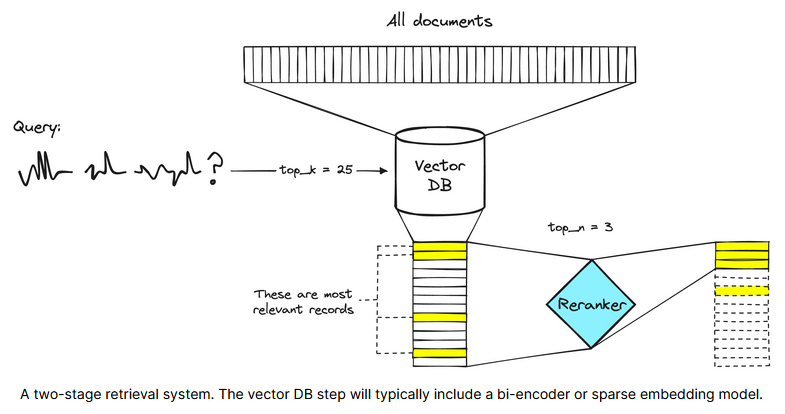

# 两阶段检索

> 英语原文：[https://www.pinecone.io/learn/series/rag/rerankers/](https://www.pinecone.io/learn/series/rag/rerankers/ "https://www.pinecone.io/learn/series/rag/rerankers/")

检索增强生成（Retrieval Augmented Generation，RAG）似乎充满了无限可能。然而，许多人在构建RAG系统后，常常感到结果并不如预期。尽管RAG易于上手，但要真正掌握其精髓却颇有难度。实际上，建立一个有效的RAG系统不仅仅是将文档放入向量数据库并叠加一个大语言模型那么简单。这种方式有时有效，但并非铁板钉钉。

## 1.召回率与上下文窗口

在深入解决方案之前，先来了解一下背后的问题。RAG通过在大量文本文档中进行语义搜索来工作，这些文档数量可能达到数十亿。为了实现大规模搜索的快速响应，一般采用向量搜索技术，即将文本转化为向量后，放入一个向量空间内，通过余弦相似度等度量标准来比较它们与查询向量的近似度。

向量搜索的前提是需要向量。这些向量基本上是将文本背后的意义压缩成768或1536维的向量形式，这一过程不可避免地会丢失一些信息。因此，常常会发现，即使是排名前三的文档，也可能遗漏了一些关键信息。如果较低位置的文档包含了有助于大语言模型更好地形成回答的相关信息，该如何是好？一个简单的方法是增加返回的文档数量（即增加top\_k值），并将它们全部传递给大语言模型。

此处关注的指标是**召回率**，即“我们检索到了多少相关文档”。值得注意的是，召回率不考虑检索到的文档总数。因此，理论上通过返回所有文档可以实现完美的召回率。然而，这在实际操作中是不可行的，因为大语言模型对可以处理的文本量有一定的限制，称之为**上下文窗口**。尽管如Anthropic的Claude这样的模型拥有高达100K Token的巨大上下文窗口，理论上可以包含大量文档，但仍然不能返回所有文档并填满上下文窗口以提高召回率。

这是因为，**在上下文窗口中填充过多内容时，会降低大语言模型在该窗口中检索信息的能力**。研究表明，当上下文窗口被过多Token填满时，大语言模型的回忆能力会受到影响。此外，过度填充上下文窗口还会使模型较难按指令执行，因此，这种做法是不可取的。

可以通过增加向量数据库返回的文档数量来提高检索的召回率，但不能在不影响大语言模型回忆性能的情况下将这些文档传递给模型。

为了解决这一问题，**可以通过检索尽可能多的文档来最大化检索召回率，然后通过尽量减少最终传递给大语言模型的文档数量**。为此，重新排序检索到的文档，并只保留最相关的文档。

## 2.重排序模型的力量

重排序模型（也被称为Cross-Encoder）是一种模型，能够针对一个查询和文档对，输出它们的相似度分数。利用这个分数对文档按照与查询的相关性进行重新排序。

一个包含两个阶段的检索系统。向量数据库（vector DB）阶段通常会包含一个双编码器（bi-encoder，Bi-Encoder）或稀疏嵌入模型。

搜索工程师长期以来在这类两阶段检索系统中使用重排序模型。在这些系统中，第一阶段的模型（一个嵌入模型或检索器）负责从更大的数据集中提取一组相关文档。随后，第二阶段的模型（即重排序器）对第一阶段提取的文档进行再排序。

之所以采用两阶段策略，是因为从大数据集中检索少量文档的速度远快于对大量文档进行重排序。很快会解释其原因，但简而言之，重排序器处理较慢，而检索器速度快。

## 3.为何选择使用重排序器？

考虑到重排序器的处理速度较慢，为什么还要使用它？关键在于，重**排序器的精确度远超过嵌入模型。**

双编码器（bi-encoder）精度较低的根本原因在于，它必须将文档的所有潜在含义压缩成一个向量——这无疑导致了信息的丢失。此外，由于查询是在收到后才知道的，双编码器对查询的上下文一无所知（我们是在用户提出查询之前就已经创建了嵌入）。

而重排序器能够在大型Transformer中直接处理原始信息，这大大减少了信息丢失。由于重排序器是在用户提出查询时才运行，这让我们能够针对具体查询分析文档的含义，而非仅生成一个泛化的、平均化的含义。

重排序器避免了双编码器的信息丢失问题——但它也有代价，那就是时间。

双编码器模型将文档或查询的含义压缩成单一向量。注意，无论是处理文档还是查询，双编码器的处理方式相同，都是在用户查询时进行。

使用双编码器和向量搜索时，会在创建初始向量时完成所有繁重的Transformer计算。这意味着，用户一旦发起查询，已经准备好了向量，接下来需要做的只是：

- 运行一个Transformer计算生成查询向量。
- 使用余弦相似度（或其他轻量度量）将查询向量与文档向量进行比较。

而对于重排序器，不进行任何预计算。相反，将查询和某个文档直接输入到Transformer中，进行一整个推理步骤，并最终生成一个相似度分数。 &#x20;

重排序器通过一个完整的Transformer推理步骤，针对查询和单一文档生成一个相似度分数。请注意，这里的文档A实际上等同于我们的查询。

假设系统有4000万条记录，使用像BERT这样的小型重排序模型在V100 GPU上运行，可能需要超过50小时来返回一个查询结果。而采用编码器模型和向量搜索，相同的查询结果可以在不到100毫秒的时间内完成。

## 4.参考文档：

1. N. Liu, K. Lin, J. Hewitt, A. Paranjape, M. Bevilacqua, F. Petroni, P. Liang, Lost in the Middle: How Language Models Use Long Contexts (2023),
2. N. Reimers, I. Gurevych, Sentence-BERT: Sentence Embeddings using Siamese BERT-Networks (2019), UKP-TUDA
